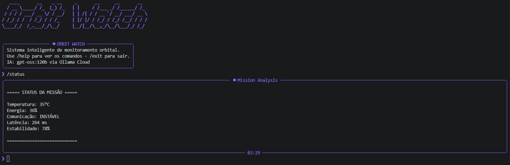
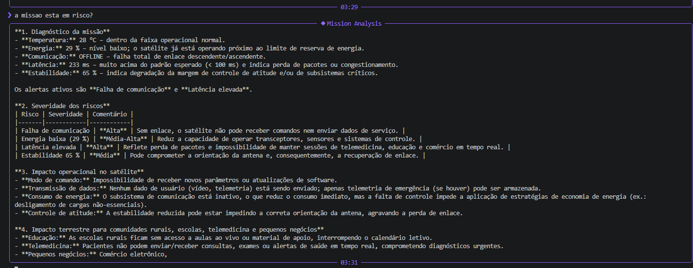

# Mission Control AI — ConnectSat

## Integrantes
- Renan Rodrigues de Matos Almeida — RM: 567952 — Turma: 1CCPA

## O que o projeto faz
Sistema de monitoramento de telemetria simulada de um satélite ConnectSat. O projeto gera dados operacionais, identifica alertas críticos em Python e usa IA generativa via Ollama Cloud para analisar a missão em linguagem natural.

## Persona atendida
Engenheiro de operações de uma rede de conectividade rural. Essa persona precisa monitorar falhas que possam afetar escolas, postos de saúde e comunidades sem acesso à internet cabeada.

## Tecnologias utilizadas
- Python 3.10+
- Ollama Cloud API
- Modelo gpt-oss:120b
- rich
- prompt-toolkit
- pyfiglet
- python-dotenv

## Como executar
1. Clone o repositório
2. Crie um ambiente virtual:
   `python -m venv .venv`
3. Ative o ambiente:
   `.venv\Scripts\activate`
4. Instale as dependências:
   `pip install -r requirements.txt`
5. Crie um arquivo `.env` com:
   `OLLAMA_API_KEY=sua_chave_aqui`
6. Execute:
   `python main.py`

## Demonstração

## System Prompt
O system prompt está disponível em `prompts/system_prompt.md`.

## Cenários de teste demonstrados
1. Operação normal
2. Temperatura crítica
3. Falha de comunicação
4. Latência elevada

## Proposta de valor / modelo de negócio
### Problema terrestre resolvido
A missão ConnectSat busca reduzir falhas de conectividade em regiões rurais, onde escolas, postos de saúde e pequenos negócios dependem de internet via satélite.

### Quem paga pela solução?
O modelo pode ser híbrido: governos podem contratar o serviço para inclusão digital, enquanto operadoras privadas podem vender conectividade para clientes rurais.

### Métrica de impacto
Se o satélite operar de forma estável por um ano, a solução pode manter centenas de escolas rurais conectadas e reduzir interrupções em atendimentos de telemedicina.

### Modelo de negócio
O modelo pode ser assinatura mensal de conectividade, contrato público de inclusão digital ou dados como serviço para operadoras e órgãos governamentais.

## Limitações conhecidas
- A telemetria é simulada.
- O sistema não se conecta a satélites reais.
- Os alertas usam thresholds simples.
- A análise da IA depende da disponibilidade da API Ollama Cloud.

## Vídeo de demonstração
Link do vídeo no YouTube: 